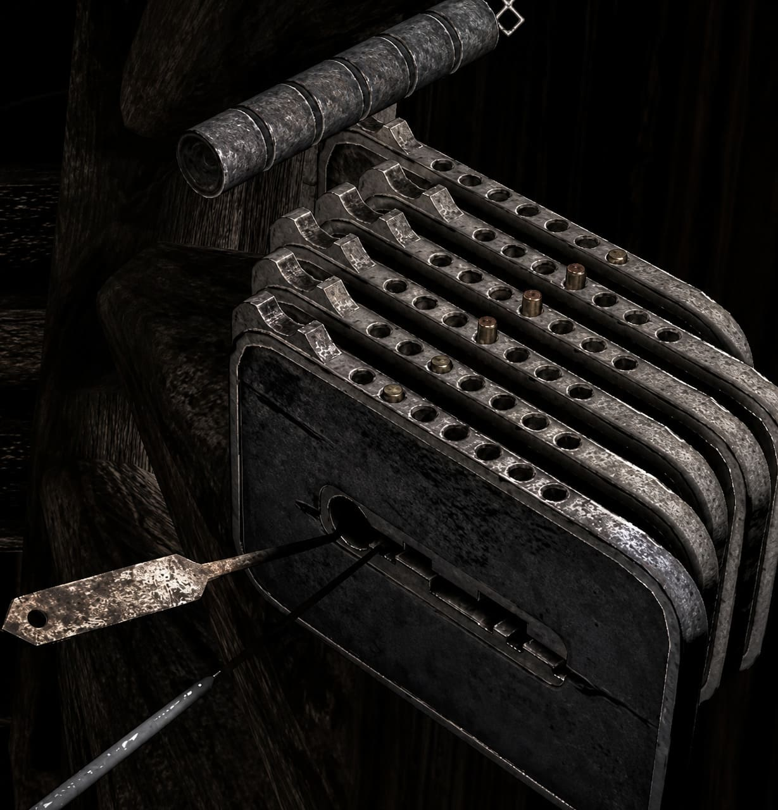

# Gothic 1 Remake (2026) - Lockpicking solver

[](https://madebyhuman.iamjarl.com)



A small .NET utility I've created to figure out the solution to the lockpicking minigame in the 2026 Gotchi 1 Remake.

As a stretch goal, this project may provide a lockpicking simulator with generated version of this puzzle to be solved.

## Minigame description

> [!NOTE]
> This description is written from personal observation and can be inaccurate.

- The minigame involves a **set of steel plates with pin-holes** at the top.
    - The more plates there are, the higher the complexity of the problem.
- Each plate has **exactly one pin** occupying one of the plate's pin-holes.
- Each pin is either in an **up or down state** depending on which pin-hole it is currently at.
- Each pin has **exactly one pin-hole in which it is in the up state**.
- All pins are visually aligned, forming a clear row through all plates.
- Each **steel plate can be moved either left or right** any number of times.
- Steel plates can be moved in **any order**.
- Moving one steel plate can have none or multiple of the following effects:
    - Moving the plate **causes one or more other plates** to move in the **same** direction.
    - Moving the plate **causes one or more other plates** to move in the **opposite** direction.
- Moving the steel plate **left** shifts its pin into the **next (right)** pin-hole.
- Moving the steel plate **right** shifts its pin into the **previous (left)** pin-hole.
- Should a steel plate attempt to move left or right (directly or indirectly by another plate) into such position, where its **pin would move out of bounds** of the pin-holes available, the minigame issues a **STRIKE** and the **movements are not applied**.
- The number of tolerated STRIKEs depends on in-game skill values, however, as a strike provides no state change, a **0 STRIKE solution is always possible**.
    - If the player reaches the STRIKE limit, the entire state of all plates resets to their original position.
- The **objective** is to execute a sequence of left and/or right steel plate movements such that **all pins end up in their up position**.

## Solving strategy

> [!NOTE]
> This is most likely not the most efficient solution.

- If we represent a specific state of steel plates, pin-holes, and pins in an encoded format, eg.:
    - `[0100,0010,0001]`
        - where `0` represents a pin-hole without a pin in it
        - and `1` represents a pin-hole with a pin in it, regardless of its state
        - and each steel-plate is represented as an ordered list of these pin-hole states separated by `,`
- And we consider a set of encoded rules eg.:
    - `P: [I+]` (real example: `0: [1:S,2:O]`)
        - where `P` represents an index of the steel plate (`0` = first plate)
        - and `I+` represents one or more instructions in the following format
        - `X:Y` (real example: `1:S`, `2:O`)
            - where `X` is an index of another steel plate (`P` must never equal `X`)
            - and `Y` is one of the following operations:
                - `S` (synchronized), the target plate moves in the same direction as the plate at index `P`
                - `O` (opposite), the target plate moves in the opposite direction of the plate at index `P`
    - If a specific plate has no rule, it can be moved without affecting any other plate
- And we consider a set of target pin positions represented as a state as defined by the first point of the strategy, eg.:
    - `[0001,1000,0100]`
- We can explore the solution space by taking the initial encoded state and applying valid moves to it while recording already visited spaces
    - This can be achieved by performing for example a [depth first search](https://en.wikipedia.org/wiki/Depth-first_search), or a [breadth first search](https://en.wikipedia.org/wiki/Breadth-first_search).

The effectiveness of BFS vs DFS is also a subject of discovery for this project.

Problem examples can be found in the `data` directory of this repo, with `real-problems` containing samples from the game, and `scenarios` containing hand-crafted problems testing various scenarios.

Each problem is a `.prob` file containing UTF-8 data in the following format:

```
[INITIAL-STATE]

[TARGET-STATE]

[RULE-SET]

```

Following the structure described above. All white-space characters including newlines should be ignored.

## Project state

This project is in its early stages. I'm working on this for fun, outside of my day-job, expect it to move slowly.

Here's where we're roughly at:
- [ ] 📍 Defining the problem and collecting data samples
- [ ] Preparing the C# solution and projects
    - [ ] Providing the ability to implement strategies separately to enable future comparison
- [ ] Implementing checks for solution correctness and step emulation
- [ ] Implementing a sample DFS strategy
- [ ] Implementing benchmarking

### Stretch goals

- [ ] Implementing solving visualizations
- [ ] Implementing a simulator for manual solution attempts
- [ ] Implementing a problem generator

## Technical details

This project uses [.NET](https://dot.net) specifically .NET 10.

### Contributing

Contributions are welcome, although this really is a simple and fun project. The goal is the fun of problem solving and exploration, it is not to be taken too seriously.

This project employed a strict no-AI policy. This entire problem could be solved by Claude in a matter of minutes, but where's the fun in that?

If you contribute, I ask you to please do everything yourself, just like the old days. =)

#### How you can help

Contributions don't always have to be code, you can help by for example:

- Collecting in-game samples of the minigame and converting them into usable data
- Providing better explanations, visualization, bechmarking, art, etc.
- Sharing ideas about expansions of the project, features, or strategies

The rule of thumb is to check what's available in [GitHub issues](https://github.com/petrspelos/gothic-remake-picklock-solver/issues) and picking something to work on.

❤️ Thank you for reading this far and for your interest in contributing, I hope you have fun! ✨
